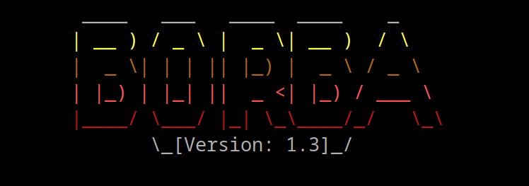
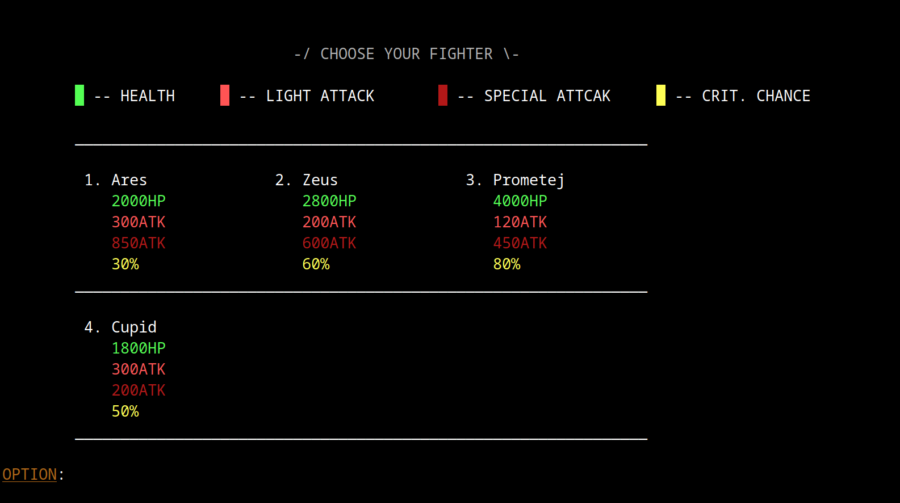

# BORBA v1.3

A modern, cross-platform, terminal-based turn-fighting game written in **C++17**.  
Refactored from a legacy codebase to demonstrate **Clean Architecture**, **RAII memory management**, and modern C++ practices.



---

##  Table of Contents

1. [About The Project](#about-the-project)
2. [Key Features](#key-features)
3. [Technical Overview](#technical-overview)
4. [Project Structure](#project-structure)
5. [Getting Started](#getting-started)
6. [Game Controls](#game-controls)
7. [Legacy vs. Modern](#legacy-vs-modern)
8. [Roadmap](#roadmap)
9. [License](#license)
10. [Contact](#contact)

---

##  About The Project

BORBA is a strategic turn-based combat simulation that runs natively in the terminal. Originally developed as a university project to explore C++ fundamentals, version **1.3** represents a complete rewrite focusing on software engineering best practices.

The primary goal of this release was to transition from a monolithic, procedural codebase to a modular, object-oriented design that separates concerns between data models, game logic, and the user interface.

---

##  Key Features

### Game Modes
- **PvE (Player vs Environment)**  
  Challenge an AI opponent with randomized decision-making logic.
- **PvP (Player vs Player)**  
  Local hot-seat multiplayer support.

### Fighter Roster
- Data-driven fighter stats loaded from CSV files (`data/fighters.csv`).
- Support for creating custom fighters and persisting them to disk.

### Combat System
- Turn-based mechanics with distinct action phases.
- **Light Attack** – Standard damage output.
- **Special Attack** – High-damage ability (single use per match).
- **Critical Hit System** – Luck-based damage multiplier.

### Custom TUI Engine
- Hand-written rendering engine using ANSI escape sequences.
- Cross-platform support for:
  - Colors
  - Cursor manipulation
  - Text animations

---

## Technical Overview

### Architecture

The project follows a **Model-View-Controller (MVC)** inspired architecture to ensure separation of concerns:

#### Models (`src/models`)
- Contains core business logic (`Fighter`, `Battle`)
- Manages:
  - State
  - Damage calculations
  - Game rules
- Completely independent of the UI

#### Views (`src/views`)
- Handles rendering (`UI`, `Animation`)
- Accepts read-only references (`const Fighter&`)
- Displays data without modifying it

 

#### Controllers (`src/controllers`)
- Manages application flow (`Forms`)
- Orchestrates:
  - User input
  - Model initialization
  - View selection

---

### Memory Management

Version **1.3** eliminates manual memory management (`new` / `delete`) in favor of **RAII (Resource Acquisition Is Initialization)** principles.

- **`std::unique_ptr`**
  - Used for owning fighter objects
  - Automatic cleanup when objects go out of scope

- **`std::shared_ptr`**
  - Used for temporary shared ownership
  - Example: fighter preview in views

- **Zero Raw Pointers**
  - All ownership transfers handled via smart pointers
  - Prevents memory leaks and dangling pointers

---

### Build System

The project uses **CMake** as the build configuration system, enabling consistent compilation across:

- GCC
- Clang
- MSVC
- Linux
- Windows
- macOS

---

## Project Structure

```text
BORBA-v1.3/
├── CMakeLists.txt          # CMake build configuration
├── data/                   # Runtime data (CSV files, Audio)
│   ├── fighters.csv
│   ├── menu.wav
│   └── battle.wav
├── docs/                   # Documentation assets
│   └── assets/             # GIFs and Screenshots
├── include/                # Header files (.h)
│   ├── controllers/        # Application flow logic
│   ├── models/             # Domain entities
│   ├── utils/              # Helper functions (File I/O, RNG)
│   └── views/              # UI rendering and animations
└── src/                    # Source files (.cpp)
    ├── main.cpp            # Application entry point
    └── ...                 # Implementation files
```

---

## Getting Started

### Prerequisites

- A C++ compiler supporting **C++17 or later**
  - Linux: GCC 9+ or Clang 10+
  - Windows: MSVC (Visual Studio 2019+) or MinGW-w64
- CMake 3.10 or newer

---

###  Installation (Linux/macOS)

#### 1️⃣ Clone the repository

```bash
git clone https://github.com/SamerKolasevic29/BORBA-v1.3.git
cd BORBA-v1.3
```

#### 2️⃣ Create a build directory

```bash
mkdir build && cd build
```

#### 3️⃣ Compile the project

```bash
cmake ..
make
```

#### 4️⃣ Run the game

```bash
./borba
```

---

### Installation (Windows)

#### 1️⃣ Open PowerShell or Command Prompt

Clone and navigate to the project folder.

#### 2️⃣ Configure and build

```powershell
mkdir build
cd build
cmake ..
cmake --build . --config Release
```

#### 3️⃣ Run the executable

```powershell
.\Release\borba.exe
```

---

## Game Controls

### Navigation
- Use number keys (`1`, `2`, `3`...) to select menu options.

### Combat
- `1` → Perform Light Attack
- `2` → Perform Special Attack

### General
- `0` → Return to previous menu / Cancel choose scene

---

## Legacy vs. Modern

| Feature | Legacy Version (v1.0) | Modern Version (v1.3) |
|----------|------------------------|------------------------|
| Language Standard | C++98 / C++03 | C++17 |
| Memory Management | Manual (`new`, `delete`) | Smart Pointers (`unique_ptr`) |
| Architecture | Monolithic (Single file) | Modular MVC |
| Build System | Dev C++ IDE | CMake |
| Platform | Windows Only (`conio.h`) | Cross-Platform (Linux/Win) |
| Data Storage | Hardcoded Arrays | CSV Parsers |

---


---

## License

This project is licensed under the **MIT License**.  
See the `LICENSE` file for details.

---

## Contact

**Samer Kolasevic**

- GitHub: https://github.com/SamerKolasevic29
- Legacy Repo from previous versions (just for comparison): https://github.com/SamerKolasevic29/BORBA-V1.0.git
- LinkedIn: https://www.linkedin.com/in/samer-kolasevi%C4%87-119aaa377/

---

> BORBA v1.3 — A modern C++ terminal fighting game showcasing clean architecture and smart memory management.